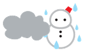
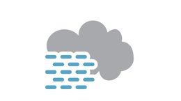
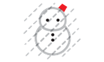

基本天気画像を組み合わせて、すべての気象テロップ番号に対応する画像を生成します。

基本天気画像は必ずしも網羅的に用意する必要はありません。例えば、多くのメディアで「霧」は「くもり」と同じマークで表現されていたり、「雨または雪」は単なる雪だるまマークで表現されていたりします。

# ファイル一覧

- `srcimgs/` —- 基本天気画像
  -  `sun.svg` -- 晴れ
  -  `cloud.svg` -- くもり
  -  `rain.svg` -- 雨
  -  `snow.svg` -- 雪
  -  `mist.svg` -- 霧
  -  `rain_and_snow.svg` -- 雨または雪/雪または雨/みぞれ
  -  `fair_night.svg` -- 晴れ (夜)
  -  `rain_heavy.svg` -- 雨強い
  -  `rain_heavy_wind.svg` -- 雨強い 風強い
  -  `snow_heavy.svg` -- 雪強い
  -  `rain_wind.svg` -- 雨 風強い
  -  `snow_wind.svg` -- 雪 風強い
  -  `rain_thunder.svg` -- 雨 雷を伴う
  -  `snow_thunder.svg` -- 雪 雷を伴う
  -  `tr.svg` -- 「のち」サイン
- `codes.json` -- 気象テロップ番号
- `generate.py` -- 生成用プログラム
- `output/` -- 生成された画像データ

# 出力例

凡例:

- `tr`: のち
- `st`: 時々
- `te`: 一時

|code|description|instruction|fkd|jtj|
|:-:|---|---|:-:|:-:|
| 100 | 晴れ | sun   |  |  |
| 101 | 晴れ時々くもり | sun st cloud |  |  |
| 102 | 晴れ一時雨 | sun te rain |  |  |
| 103 | 晴れ時々雨 | sun st rain |  |  |
| 104 | 晴れ一時雪 | sun te snow |  |  |
| 105 | 晴れ時々雪 | sun st snow |  |  |
| 106 | 晴れ一時雨か雪 | sun te rain_or_snow |  |  |
| 107 | 晴れ時々雨か雪 | sun st rain_or_snow |  |  |
| 108 | 晴れ一時雨か雷雨 | sun te rain_thunder |  |  |
| 110 | 晴れのち時々くもり | sun trst cloud |  |  |
| 111 | 晴れのちくもり | sun tr cloud |  |  |
| 112 | 晴れのち一時雨 | sun trst rain |  |  |
| 113 | 晴れのち時々雨 | sun trte rain |  |  |
| 114 | 晴れのち雨 | sun tr rain |  |  |
| 115 | 晴れのち一時雪 | sun trte snow |  |  |
| 116 | 晴れのち時々雪 | sun trst snow |  |  |
| 117 | 晴れのち雪 | sun tr snow |  |  |
| 118 | 晴れのち雨か雪 | sun tr rain_or_snow |  |  |
| 119 | 晴れのち雨か雷雨 | sun tr rain_thunder |  |  |
| 120 | 晴れ朝夕一時雨 | sun te rain |  |  |
| 121 | 晴れ朝の内一時雨 | sun te rain |  |  |
| 122 | 晴れ夕方一時雨 | sun te rain |  |  |
| 123 | 晴れ山沿い雷雨 | sun   |  |  |
| 124 | 晴れ山沿い雪 | sun   |  |  |
| 125 | 晴れ午後は雷雨 | sun tr rain_thunder |  |  |
| 126 | 晴れ昼頃から雨 | sun tr rain |  |  |
| 127 | 晴れ夕方から雨 | sun tr rain |  |  |
| 128 | 晴れ夜は雨 | sun tr rain |  |  |
| 129 | 晴れ夜半から雨 | sun tr rain |  |  |
| 130 | 朝の内霧後晴れ | mist tr sun |  |  |
| 131 | 晴れ明け方霧 | sun tr mist |  |  |
| 132 | 晴れ朝夕くもり | sun st cloud |  |  |
| 140 | 晴れ時々雨で雷を伴う | sun st rain_thunder |  |  |
| 160 | 晴れ一時雪か雨 | sun te snow_or_rain |  |  |
| 170 | 晴れ時々雪か雨 | sun st snow_or_rain |  |  |
| 181 | 晴れのち雪か雨 | sun tr snow_or_rain |  |  |
| 200 | くもり | cloud   |  |  |
| 201 | くもり時々晴 | cloud st sun |  |  |
| 202 | くもり一時雨 | cloud te rain |  |  |
| 203 | くもり時々雨 | cloud st rain |  |  |
| 204 | くもり一時雪 | cloud te snow |  |  |
| 205 | くもり時々雪 | cloud st snow |  |  |
| 206 | くもり一時雨か雪 | cloud te rain_or_snow |  |  |
| 207 | くもり時々雨か雪 | cloud st rain_or_snow |  |  |
| 208 | くもり一時雨か雷雨 | cloud te rain_thunder |  |  |
| 209 | 霧 | mist   |  |  |
| 210 | くもりのち時々晴れ | cloud trst sun |  |  |
| 211 | くもりのち晴れ | cloud tr sun |  |  |
| 212 | くもりのち一時雨 | cloud trte rain |  |  |
| 213 | くもりのち時々雨 | cloud trst rain |  |  |
| 214 | くもりのち雨 | cloud tr rain |  |  |
| 215 | くもりのち一時雪 | cloud trte snow |  |  |
| 216 | くもりのち時々雪 | cloud trst snow |  |  |
| 217 | くもりのち雪 | cloud tr snow |  |  |
| 218 | くもりのち雨か雪 | cloud tr rain |  |  |
| 219 | くもりのち雨か雷雨 | cloud tr rain |  |  |
| 220 | くもり朝夕一時雨 | cloud te rain |  |  |
| 221 | くもり朝の内一時雨 | cloud te rain |  |  |
| 222 | くもり夕方一時雨 | cloud te rain |  |  |
| 223 | くもり日中時々晴れ | cloud st sun |  |  |
| 224 | くもり昼頃から雨 | cloud tr rain |  |  |
| 225 | くもり夕方から雨 | cloud tr rain |  |  |
| 226 | くもり夜は雨 | cloud tr rain |  |  |
| 227 | くもり夜半から雨 | cloud tr rain |  |  |
| 228 | くもり昼頃から雪 | cloud tr snow |  |  |
| 229 | くもり夕方から雪 | cloud tr snow |  |  |
| 230 | くもり夜は雪 | cloud tr snow |  |  |
| 231 | くもり海上海岸は霧か霧雨 | cloud   |  |  |
| 240 | くもり時々雨で雷を伴う | cloud te rain_thunder |  |  |
| 250 | くもり時々雪で雷を伴う | cloud st snow_thunder |  |  |
| 260 | くもり一時雪か雨 | cloud te snow_or_rain |  |  |
| 270 | くもり時々雪か雨 | cloud st snow_or_rain |  |  |
| 281 | くもりのち雪か雨 | cloud tr snow_or_rain |  |  |
| 300 | 雨 | rain   |  |  |
| 301 | 雨時々晴れ | rain st sun |  |  |
| 302 | 雨時々止む | rain st cloud |  |  |
| 303 | 雨時々雪 | rain st snow |  |  |
| 304 | 雨か雪 | rain_or_snow   |  |  |
| 306 | 大雨 | rain_heavy   |  |  |
| 307 | 風雨共に強い | rain_heavy_wind   |  |  |
| 308 | 雨で暴風を伴う | rain_wind   |  |  |
| 309 | 雨一時雪 | rain te snow |  |  |
| 311 | 雨のち晴れ | rain tr sun |  |  |
| 313 | 雨のちくもり | rain tr cloud |  |  |
| 314 | 雨のち時々雪 | rain trst snow |  |  |
| 315 | 雨のち雪 | rain tr snow |  |  |
| 316 | 雨か雪のち晴れ | rain_or_snow tr sun |  |  |
| 317 | 雨か雪のちくもり | rain_or_snow tr cloud |  |  |
| 320 | 朝の内雨のち晴れ | rain tr sun |  |  |
| 321 | 朝の内雨のちくもり | rain tr cloud |  |  |
| 322 | 雨朝晩一時雪 | rain te snow |  |  |
| 323 | 雨昼頃から晴れ | rain tr sun |  |  |
| 324 | 雨夕方から晴れ | rain tr sun |  |  |
| 325 | 雨夜は晴 | rain tr sun |  |  |
| 326 | 雨夕方から雪 | rain tr snow |  |  |
| 327 | 雨夜は雪 | rain tr snow |  |  |
| 328 | 雨一時強く降る | rain te rain_heavy |  |  |
| 329 | 雨一時みぞれ | rain te rain_and_snow |  |  |
| 340 | 雪か雨 | snow_or_rain   |  |  |
| 350 | 雨で雷を伴う | rain_thunder   |  |  |
| 361 | 雪か雨のち晴れ | snow_or_rain tr sun |  |  |
| 371 | 雪か雨のちくもり | snow_or_rain tr cloud |  |  |
| 400 | 雪 | snow   |  |  |
| 401 | 雪時々晴れ | snow st sun |  |  |
| 402 | 雪時々止む | snow st cloud |  |  |
| 403 | 雪時々雨 | snow st rain |  |  |
| 405 | 大雪 | snow_heavy   |  |  |
| 406 | 風雪強い | snow_wind   |  |  |
| 407 | 暴風雪 | snow_wind   |  |  |
| 409 | 雪一時雨 | snow te rain |  |  |
| 411 | 雪のち晴れ | snow tr sun |  |  |
| 413 | 雪のちくもり | snow tr cloud |  |  |
| 414 | 雪のち雨 | snow tr rain |  |  |
| 420 | 朝の内雪のち晴れ | snow tr sun |  |  |
| 421 | 朝の内雪のちくもり | snow tr cloud |  |  |
| 422 | 雪昼頃から雨 | snow tr rain |  |  |
| 423 | 雪夕方から雨 | snow tr rain |  |  |
| 424 | 雪夜半から雨 | snow tr rain |  |  |
| 425 | 雪一時強く降る | snow te snow_heavy |  |  |
| 426 | 雪のちみぞれ | snow tr rain_and_snow |  |  |
| 427 | 雪一時みぞれ | snow te rain_and_snow |  |  |
| 450 | 雪で雷を伴う | snow_thunder   |  |  |
| 700 |  | night_fair   |  |  |
| 701 |  | night_fair st cloud |  |  |
| 702 |  | night_fair te rain |  |  |
| 703 |  | night_fair st rain |  |  |
| 704 |  | night_fair te snow |  |  |
| 705 |  | night_fair st snow |  |  |
| 706 |  | night_fair te rain_or_snow |  |  |
| 707 |  | night_fair st rain_or_snow |  |  |
| 708 |  | night_fair te rain_thunder |  |  |
| 710 |  | night_fair trst cloud |  |  |
| 711 |  | night_fair tr cloud |  |  |
| 712 |  | night_fair trst rain |  |  |
| 713 |  | night_fair trte rain |  |  |
| 714 |  | night_fair tr rain |  |  |
| 715 |  | night_fair trte snow |  |  |
| 716 |  | night_fair trst snow |  |  |
| 717 |  | night_fair tr snow |  |  |
| 718 |  | night_fair tr rain_or_snow |  |  |
| 719 |  | night_fair tr rain_thunder |  |  |
| 720 |  | night_fair te rain |  |  |
| 721 |  | night_fair te rain |  |  |
| 722 |  | night_fair te rain |  |  |
| 723 |  | night_fair   |  |  |
| 724 |  | night_fair   |  |  |
| 725 |  | night_fair tr rain_thunder |  |  |
| 726 |  | night_fair tr rain |  |  |
| 727 |  | night_fair tr rain |  |  |
| 728 |  | night_fair tr rain |  |  |
| 729 |  | night_fair tr rain |  |  |
| 730 |  | mist tr sun |  |  |
| 731 |  | night_fair tr mist |  |  |
| 732 |  | night_fair st cloud |  |  |
| 740 |  | night_fair st rain_thunder |  |  |
| 760 |  | night_fair te snow_or_rain |  |  |
| 770 |  | night_fair st snow_or_rain |  |  |
| 781 |  | night_fair tr snow_or_rain |  |  |
